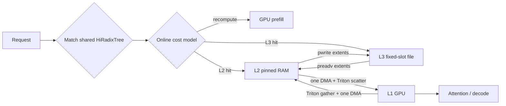
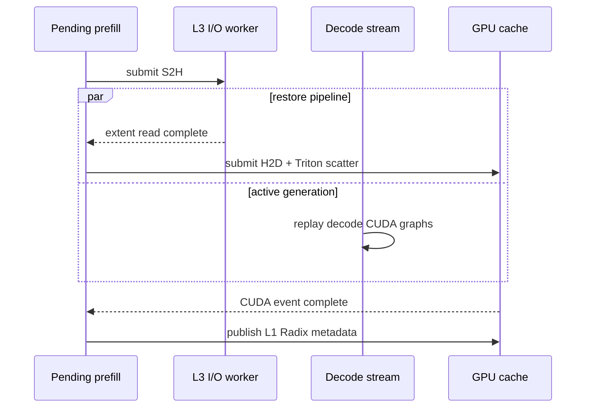

# Mini-HiCache Design

Status: Implemented and validated on NVIDIA RTX 5070 (SM120)

## Goals and Scope

Mini-HiCache extends the Radix Cache from GPU memory into a local three-tier hierarchy:

1. **L1 GPU** contains pages that attention kernels can read immediately.
2. **L2 pinned RAM** retains evicted prefixes and supports asynchronous PCIe transfers.
3. **L3 local storage** provides a larger fixed-slot cache and restores through L2.

The design targets repeated long prefixes, such as system prompts, documents, and agent
histories. It is opt-in, page aligned, MHA-only, and transparent to attention backends. The
normal cache path is unchanged unless `--enable-hicache` is set. Remote cache services,
restart-persistent metadata, KV compression, and MLA pools are outside the current scope.



## Physical Layout and Metadata

The live GPU pool remains attention-friendly:

```text
L1: [K/V, layer, physical-page, token-in-page, local-kv-head, head-dim]
```

L2 is page-major so a complete page is physically contiguous:

```text
L2: [physical-page, K/V, layer, token-in-page, local-kv-head, head-dim]
```

`HostMHAKVCache.buffer` exposes a compatibility view in L1 order, while
`page_buffer` exposes contiguous L2 storage. L3 assigns every page a stable byte range:

```text
bytes_per_page = 2 * layers * page_size * local_kv_heads * head_dim * dtype_size
offset(page)   = page * bytes_per_page
```

The hierarchy owns one `HiRadixTree` token topology. Each node carries optional GPU, host, and
storage values containing token indices into the corresponding physical pool. Tier-specific
views keep independent reference counts, LRU timestamps, and size accounting while sharing
node splits and parent/child links. One topology walk therefore produces the potentially
different L1, L2, and L3 lengths in `MatchResult`.

Evicting one residency clears only that node's value for the selected tier. The node remains
while another tier or a descendant still owns data, and it is removed from the shared topology
only after all three values and references are gone. A request's `cached_len` advances only
after lower-tier bytes are ready in L1 and the GPU value has been published.

## Fused GPU and Host Transfers

`CacheTransferManager` uses one private CUDA stream and reusable best-fit workspaces. A D2H
transfer performs:

1. one Triton launch to gather every selected page across K/V and all layers into page-major
   GPU memory;
2. one asynchronous DMA into pinned memory; and
3. a CPU scatter only when destination pages are fragmented.

H2D reverses the pipeline: gather fragmented host pages once, issue one DMA, and use one
Triton launch to scatter into arbitrary GPU pages. Consecutive host allocations bypass the
CPU gather/scatter entirely. The allocator keeps free lists sorted to make this fast path
common.

The Triton kernels flatten the full page payload and map each logical packed offset to:

```text
physical_offset = ((kv * layers + layer) * pool_pages + page_id) * page_elements + inner
```

`--hicache-transfer-backend auto` microbenchmarks Triton and PyTorch independently for gather
and scatter using the current KV geometry. It can therefore select a hybrid such as Triton
gather plus `torch.index_copy_` scatter. Compilation failure falls back to PyTorch. Explicit
`triton` makes failure visible; explicit `torch` is a portable reference path. Initialization
then warms one unmanaged dummy page so JIT compilation does not contaminate the first measured
request. Workspace allocation time is reported but excluded from learned steady-state
bandwidth.

## Batched L3 I/O

L3 uses a preallocated mode-`0600` file. The storage allocator and L2 allocator return sorted
physical slots when possible. Source/destination mappings are coalesced only when both sides
are adjacent, preserving arbitrary remapping while turning a long prefix into a small number
of extents.

Writes pass a direct `memoryview` of page-major pinned tensors to `os.pwrite`; reads use
`os.preadv` directly into their final pinned tensor ranges. This removes per-page Python loops,
temporary `bytearray` objects, and tensor serialization. A bounded thread pool handles file
I/O. Direct GPU/L3 paths are chunked through reserved pinned staging pages; normal L3 hits are
promoted into L2 and then copied H2D.

## Online Cost Model

Always restoring the longest prefix can be slower than recomputation, especially for small
models or slow storage. The default `cost` policy learns the decision online. For `n` reusable
tokens and `b` bytes per token, it estimates:

```text
C_recompute = prefill_fixed + n * prefill_seconds_per_token
C_L2        = H2D_fixed + n * b * H2D_seconds_per_byte
C_L3        = S2H_fixed + H2D_fixed
              + n * b * (S2H_seconds_per_byte + H2D_seconds_per_byte)
benefit     = C_recompute - margin * C_restore
```

The positive-benefit candidate with the largest saving wins; otherwise the scheduler keeps
the L1 hit and recomputes. Admission uses the same future restore cost, because D2H/H2S
write-through is asynchronous and not part of the future request's critical path. `always`
is retained for deterministic testing and forced-tier benchmarks.

The model starts from configurable bandwidth and recomputation priors. For one observed size,
it retains the slope prior and learns the positive fixed residual with a 0.2 EWMA. Once recent
samples contain meaningfully different sizes, constrained least squares fits a non-negative
intercept and slope over a sliding 32-sample window. Transfer samples include enqueue, queue
wait, kernel/DMA or file service, and CPU completion work; one-time workspace setup is excluded.
Storage read and write models are kept separate because they are commonly asymmetric.
Reverse-direction samples are used only for the approximately symmetric PCIe link.

## Ownership and Publication State Machine

A new page-aligned prefix follows an asynchronous write-through path:

```text
L1_PRIVATE -> D2H_PENDING -> L1_L2 -> H2S_PENDING -> L1_L2_L3
```

Restoration follows one of these paths:

```text
L2 -> H2D_PENDING -> L1_L2
L3 -> S2H_PENDING -> L2_L3 -> H2D_PENDING -> L1_L2_L3
```

Every pending operation reserves private destination pages and locks its published source
handle. Metadata is committed only after the CUDA event or I/O future succeeds. Failures free
only still-private pages, release source locks, restore the previous L1 table entry, and fall
back to recomputation. Once insertion transfers page ownership to the HiRadixTree, failure
cleanup never returns those pages to a free list.

The core invariants are:

1. tree-owned, allocator-free, and transfer-private pages are disjoint;
2. an in-flight source cannot be evicted or reused;
3. all allocation, insertion, splitting, and transfer boundaries are page aligned;
4. L1/L2/L3 copies contain the same rank-local KV shard;
5. completion precedes publication, and publication precedes `Req.cached_len` updates; and
6. after draining transfers, `free_pages + tree_pages == capacity_pages` in every tier.

`HiRadixTree.check_integrity()` also verifies the shared parent links, per-tier size accounting,
reference counts, alignment, contiguous tier residency, and duplicate physical indices.

## Decode-Overlapped Restoration

`PendingMaterialization` represents a private asynchronous restore. During overlap scheduling,
the first prefill candidate may start S2H or H2D and remain in the pending queue. The scheduler
then admits a runnable decode batch instead of blocking. Later iterations poll the ticket,
advance S2H to H2D, publish L1, and finally admit the restored request.



Abort and shutdown paths drain or cancel this state without leaking the request table row.
`--disable-hicache-prefetch` reverts to blocking restoration.

## Eviction, Promotion, and Tensor Parallelism

Every tier uses independent LRU leaf eviction over the shared topology. L1 eviction clears only
the GPU value, L2 eviction clears only the host value, and L3 eviction releases only the local
fixed-file slot. A locally empty leaf is deleted only when no tier still owns it. L3 restoration
normally promotes the full prefix to L2, improving future reuse. Promotion can be disabled to
avoid L2 pollution.

Each tensor-parallel rank stores only its local KV-head shard. Capacities are derived from the
rank-local bytes per page, and deterministic scheduling keeps allocation transitions aligned.
Explicit L3 paths receive a `.rankN` suffix so ranks cannot overwrite each other's file.

## Configuration

```text
--enable-hicache
--hicache-size-gb FLOAT                 # explicit L2 GiB; overrides ratio
--hicache-ratio FLOAT                   # L2/L1 page ratio; default 1
--hicache-storage-size-gb FLOAT         # explicit L3 GiB; overrides ratio
--hicache-storage-ratio FLOAT           # L3/L1 page ratio; default 0
--hicache-storage-path PATH             # preferably a local NVMe path
--hicache-io-workers INT                # default 2
--hicache-staging-pages INT             # default 8
--disable-hicache-storage-promotion
--hicache-policy {cost,always}           # default cost
--hicache-recompute-us-per-token FLOAT   # initial prior; default 50
--hicache-host-bandwidth-gib-s FLOAT     # initial prior; default 12
--hicache-storage-bandwidth-gib-s FLOAT  # initial prior; default 3
--hicache-cost-margin FLOAT              # default 1.1
--disable-hicache-prefetch
--hicache-transfer-backend {auto,triton,torch}
```

An omitted storage path creates a temporary file that is deleted at shutdown. An explicit
file is truncated at startup because prefix metadata is process scoped.

## Observability

`CacheManager.hicache_status()` reports capacity and free/protected/evictable pages, pending
backup/materialization counts, per-direction selected backends and autotune timings, and
cost-model state. Metrics cover:

- L1/L2/L3 hit and recomputed tokens, evictions, promotions, fallbacks, and policy skips;
- bytes, transfer count, recurring seconds, and effective GiB/s for D2H/H2D/H2S/S2H;
- L3 extent count, exposing fragmentation independently of byte throughput;
- enqueue, workspace setup, queue wait, service, and end-to-end transfer latency; and
- restore request count, restore end-to-end time, and decode-overlapped restore time.

These are local introspection data and do not add a serving endpoint.

## Validation and Performance

Run correctness, forced-tier latency, and overlap validation with:

```bash
pytest tests/core tests/misc --no-cov -q
pytest tests/kernel/test_hicache.py --no-cov -q
python benchmark/offline/bench_hicache.py --model MODEL --tier l3 \
    --num-pages 512 --prefix-tokens 350 --policy always
python benchmark/offline/bench_hicache_overlap.py --model MODEL \
    --num-pages 512 --prefix-tokens 350 --decode-tokens 64
python benchmark/offline/bench_hicache_stress.py --model MODEL --tier l3 \
    --num-pages 1536 --prefix-tokens 300 --num-prefixes 12 \
    --requests 400 --batch-size 4 --host-ratio 1 --storage-ratio 3 \
    --policy cost --check-every 25
```

Forced `A -> B -> A/B` tests on an RTX 5070 used FlashInfer, BF16, page size 1, and verified
identical generated tokens. Times are median request latency after warmup:

| Model / prefix | Recompute | L2 restore | L3 restore |
|---|---:|---:|---:|
| Qwen3-0.6B / 520 tokens | 18.054 ms | 14.175 ms (-21.5%) | 19.574 ms (+8.4%) |
| Qwen3-4B / 350 tokens | 66.747 ms | 20.320 ms (-69.6%) | 30.059 ms (-55.0%) |

The smaller model demonstrates why the default cost policy is necessary: forced L3 can lose
to cheap recomputation. The 4B result shows the intended regime, with L2 providing a 3.28x
speedup and L3 a 2.22x speedup. For the 4B KV geometry, the 256-page autotune measured Triton
gather at 0.159 ms versus PyTorch at 0.359 ms, and Triton scatter at 0.144 ms versus 0.170 ms.
The auto L2 median was 20.320 ms versus 21.040 ms with the forced PyTorch backend. The overlap
benchmark started from an L3-only 349-token hit, kept a separate 64-token decode active,
recorded one overlapped restore, and reproduced the original output token. It measured 57.15
ms in the decode-overlapped interval out of 58.51 ms restore end-to-end time.

The stress benchmark uses deterministic round-robin prefixes whose working set exceeds L1.
This removes incidental L1 hits and reports throughput, effective request latency, batch
P50/P95/P99, per-tier token hits, transfer traffic, output equality, and allocator integrity.
On the same RTX 5070, Qwen3-4B with eight 350-token prefixes, 512 L1 pages, and 80 sequential
requests produced:

| Path | Throughput | Effective latency | P50 | P99 | Speedup |
|---|---:|---:|---:|---:|---:|
| Recompute | 16.465 req/s | 60.735 ms | 60.744 ms | 62.449 ms | 1.00x |
| L2, 4096 pages | 44.610 req/s | 22.417 ms | 21.189 ms | 34.664 ms | 2.71x |
| L3, 512 L2 + 4096 L3 pages | 35.577 req/s | 28.108 ms | 26.017 ms | 39.901 ms | 2.16x |

For four-way concurrency, 12 prefixes of 300 tokens, and 80 requests, recomputation reached
25.460 req/s with 158.396 ms batch P99. L3 with 1536 pages in both L1 and L2 plus 4608 L3
pages reached 81.365 req/s with the default `cost` policy: 3.20x throughput, 55.006 ms batch
P99, 23,920 L3-hit tokens, and only 80 recomputed boundary tokens. Forced `always` was within
0.4%, showing that the learned policy selected the profitable path without benchmark-only
configuration.

A longer 400-request run sustained 80.492 req/s while restoring 119,600 tokens and reading
16.43 GiB from L3 at 12.398 GiB/s. It performed 400 reads in 480 extents, passed four periodic
and one final integrity check, preserved all output tokens, and recorded no backup failure,
restore fallback, storage eviction, GPU-memory growth, or temporary-file leak. The temporary
`/tmp` file and repeated working set make these warm local-file/page-cache numbers rather than
cold-NVMe guarantees.

L3 numbers depend strongly on filesystem, page cache, and contention. Use an explicit NVMe
path and report hardware, filesystem, cache state, model, prefix length, and policy in PRs.

## Limitations and Follow-Up

- The L3 worker uses portable Python `preadv`/`pwrite`, not `io_uring`, `O_DIRECT`, GPUDirect
  Storage, or device-side decompression.
- Prefix metadata is not crash persistent. Safe restart reuse needs model/tokenizer and TP
  fingerprints, a versioned manifest, checksums, and a metadata journal.
- The online model predicts latency, not reuse probability. A frequency-aware admission model
  could further reduce write bandwidth and cache pollution.
- The pool retains only its largest idle packed workspace, but simultaneous long transfers can
  still consume significant temporary pinned and GPU memory. Production deployments should
  size concurrency and prefix limits together.

## Prior Art

- [SGLang HiCache design](https://github.com/sgl-project/sglang/blob/main/docs_new/docs/advanced_features/hicache_design.mdx)
- [SGLang HiCache best practices](https://github.com/sgl-project/sglang/blob/main/docs_new/docs/advanced_features/hicache_best_practices.mdx)
